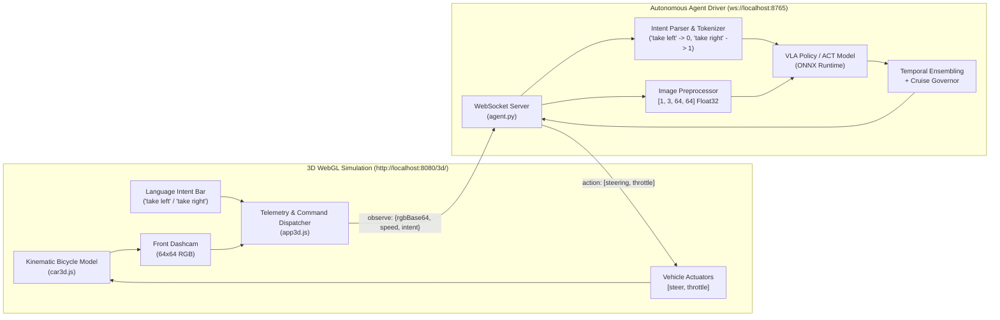

# 🏎️ NeuroDrive VLA — Vision-Language-Action Autonomous Driving Stack

An end-to-end autonomous driving platform featuring a **3D WebGL physics environment (Three.js)**, **natural language intent conditioning** (*"take left"* vs. *"take right"* at the roundabout), automated **DAgger (Dataset Aggregation)** expert demonstrations via headless browser automation (Playwright), and a decoupled **Python WebSocket driver (`agent.py`)** with real-time actuation telemetry.

---

## 🌟 Key Highlights & Engineering Features

- **💬 Natural Language Intent Dispatch:** Interactive HUD prompt bar (`Command the AI: "take left", "take right"...`), one-click suggestion chips, and hotkeys (`1` / `2`). Language commands are parsed, tokenized (`0` = left, `1` = right), and synchronized over WebSocket in under 2 ms.
- **🌐 In-Browser 3D Simulation & Telemetry:** Built with Three.js featuring real-time vehicle kinematics, multi-surface friction (tarmac vs. grass), dynamic daylighting, third-person chase camera, overhead helicopter camera, and live GPS radar.
- **👁️ First-Person Dashcam Perception:** Dedicated forward-facing dashcam renders a $64 \times 64 \times 3$ RGB observation feed with a true 1:1 aspect ratio, giving the agent an authentic driver's view of curves, curbs, and garage stalls.
- **⚡ Standalone Python Agent (`agent.py`):** Completely decouples driver intelligence from the simulation client. Receives camera frames and language intents over local WebSocket (`ws://localhost:8765`), manages Temporal Ensembling across trajectory chunks, and bridges continuous control signals back to the vehicle plant.
- **🤖 Automated DAgger Data Collection (`collect_dagger.py`):** Headless Playwright script executes high-speed parallel rollouts with Ornstein-Uhlenbeck (OU) exploration noise, off-road grass recovery bursts, and a balanced 50/50 left/right roundabout route distribution.
- **📦 Pre-Labeled Multimodal Dataset (`dataset_dagger.pt`):** Contains 14,050 transition frames ($64 \times 64 \times 3$ `uint8`), continuous expert action labels, vehicle states, and per-episode branch labels (`'left'` vs. `'right'`) ready for VLA training.

---

## 🏛️ System Architecture



---

## 📁 Repository Structure

```
.
├── 3d/                          # 3D WebGL Simulation Environment
│   ├── index.html               # Main simulation dashboard & HUD interface
│   ├── css/
│   │   └── style.css            # Dark glassmorphism HUD & Language Intent styling
│   ├── js/
│   │   ├── app3d.js             # Simulation runner, intent parsing & WebSocket bridge
│   │   ├── car3d.js             # Vehicle kinematics, steering inertia & friction
│   │   ├── track3d.js           # 3D track mesh, roundabout, S-curves & garage
│   │   ├── oracle3d.js          # Pure pursuit Oracle with left/right roundabout branches
│   │   ├── scenery.js           # Procedural trees, buildings, barriers & terrain
│   │   └── collection_bridge.js # Bridge interface for headless Playwright rollouts
│   ├── model_act.onnx           # Active policy model weights
│   └── vendor/                  # Three.js r128 & ONNX Runtime Web dependencies
├── agent.py                     # Standalone Python WebSocket agent with language intent support
├── collect_dagger.py            # Automated headless DAgger data collection script
├── dataset_dagger.pt            # 14,050 transition frames with branch metadata
├── plot_trajectories.py         # Matplotlib trajectory visualization utility
├── index.html                   # Root HTTP redirect to /3d/
├── requirements.txt             # Python dependencies
├── LICENSE                      # MIT License
└── README.md                    # Project documentation
```

---

## 🛠️ Getting Started

### 1. Prerequisites & Virtual Environment

Ensure you have **Python 3.10+** and a modern browser (Google Chrome or Chromium) installed:

```bash
# Clone the repository
git clone https://github.com/rocksfun/Self-Driving-car.git
cd Self-Driving-car

# Create and activate virtual environment
python3 -m venv .venv
source .venv/bin/activate

# Install dependencies
pip install -r requirements.txt

# Install Playwright browser binaries
playwright install chromium
```

### 2. Running the Simulation & Agent

#### Terminal 1 — Host the 3D Web Environment:
```bash
# Host the simulation on port 8080
python3 -m http.server 8080
```

#### Terminal 2 — Start the Autonomous Agent:
```bash
# Start the WebSocket agent driver (default intent: "take right")
.venv/bin/python agent.py

# Or start with a specific initial command:
.venv/bin/python agent.py --intent "take left"
```

#### In Your Browser:
Open **[http://localhost:8080/3d/](http://localhost:8080/3d/)** and click **🤖 Autonomous** mode.

---

## 💬 Using Language Intent Commands

When in **Autonomous Mode**, use the **💬 LANGUAGE INTENT** control panel on the right HUD:

1. **Text Input Bar:** Type natural commands like:
   - `"take left"`, `"turn left"`, `"go left"` $\to$ parses to **TAKE LEFT** (Token ID: `0`)
   - `"take right"`, `"turn right"`, `"go right"` $\to$ parses to **TAKE RIGHT** (Token ID: `1`)
   - Press <kbd>Enter</kbd> or click **Send**.
2. **Quick Chips:** Click `↰ take left` or `↱ take right` for instant one-click switching.
3. **Keyboard Hotkeys:** Press <kbd>1</kbd> for left and <kbd>2</kbd> for right during live driving.
4. **Live Feedback:** Both the browser HUD and the Python `agent.py` terminal display instant acknowledgment and update the active intent token.

---

## 🎮 Keyboard Controls (Manual Mode)

| Key | Action |
| :--- | :--- |
| `W` / `Up Arrow` | Throttle / Accelerate |
| `S` / `Down Arrow` | Brake / Reverse |
| `A` / `Left Arrow` | Steer Left |
| `D` / `Right Arrow` | Steer Right |
| `1` | Set Language Intent to **Take Left** |
| `2` | Set Language Intent to **Take Right** |
| `C` | Toggle Camera (Chase View $\leftrightarrow$ Helicopter View) |
| `R` | Reset Car to South Start Line |
| `Space` | Toggle Manual Recording / Toggle Autonomous Drive |

---

## 📊 Dataset & Trajectory Analysis

The dataset in `dataset_dagger.pt` contains **14,050 transitions** captured from balanced DAgger rollouts:
- **Left Roundabout Branch:** Clockwise ingress around the roundabout island.
- **Right Roundabout Branch:** Counter-clockwise ingress around the roundabout island.
- **Perturbation Recovery:** Scheduled off-road grass drift bursts that capture dense recovery demonstrations back to the road centerline.

To visualize recorded episodes and trajectory coverage:
```bash
.venv/bin/python plot_trajectories.py --dataset dataset_dagger.pt --output episode_paths_plot.png
```

---

## 🏎️ Vehicle Physics & Control Mechanics

The physics simulation in [`3d/js/car3d.js`](3d/js/car3d.js) implements an **Ackermann kinematic bicycle model**:

$$\dot{x} = -v \sin(\theta)$$
$$\dot{z} = -v \cos(\theta)$$
$$\dot{\theta} = \frac{v}{L} \tan(\delta)$$

- **Multi-Surface Friction:** Dynamic ground deceleration ($12.0\text{ m/s}^2$ on tarmac vs. $24.0\text{ m/s}^2$ off-road).
- **Steering Wheel Lag:** Front wheel steer angle transitions smoothly via rate-limited exponential lag:
  $$\delta_{t+1} = \delta_t + (\delta_{\text{target}} - \delta_t) \cdot 12.0 \cdot \Delta t$$
- **Continuous Zero-Jerk Cruise Governor:** Actuator envelope regulation in `agent.py` tapers throttle smoothly between $11.5\text{ m/s}$ and $13.5\text{ m/s}$, maintaining smooth cruising without mode-collapse stalling.

---

## 📜 License

This project is open-source under the [MIT License](LICENSE).
