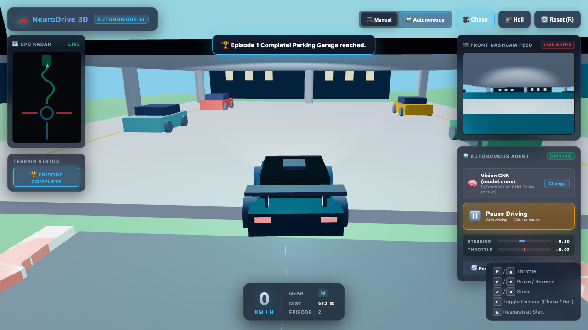
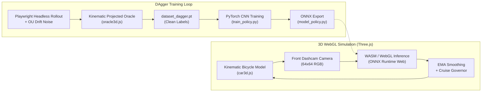
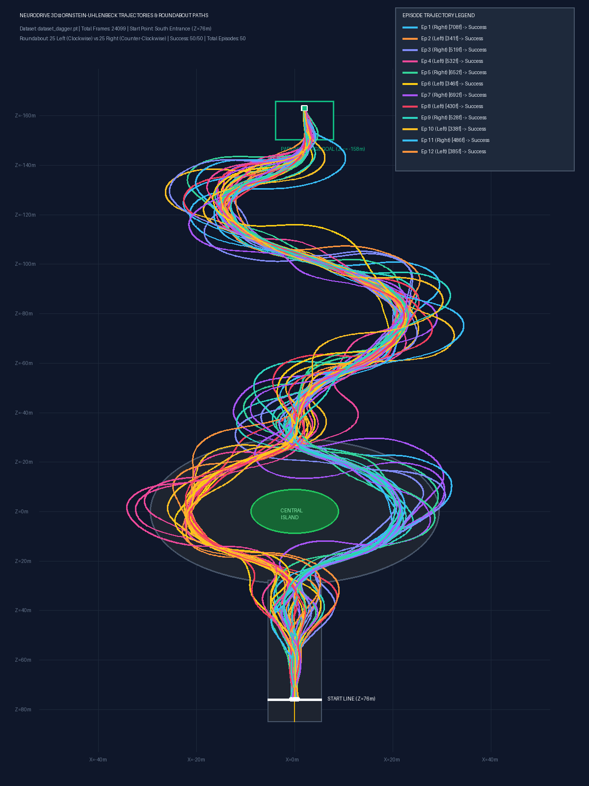

# 🏎️ Autonomous Self-Driving Car (End-to-End Vision CNN + DAgger)

An end-to-end autonomous driving stack featuring a **3D WebGL physics environment (Three.js)**, automated **DAgger (Dataset Aggregation)** expert supervision via headless browser automation (Playwright), a **PyTorch Vision Convolutional Neural Network (CNN)** policy, and real-time **in-browser ONNX Runtime Web** inference.


*Autonomous agent completing a full course lap from the South Start Line to a perfect stop inside the Parking Garage.*

---

## 🌟 Key Highlights & Engineering Features

- **🌐 In-Browser 3D Simulation & Telemetry:** Built with Three.js featuring real-time vehicle kinematics, multi-surface friction (road vs. grass), dynamic day lighting, third-person chase camera, helicopter overhead camera, HUD dashboard, and live GPS radar.
- **👁️ First-Person Dashcam Perception:** A dedicated forward-facing camera renders a $64 \times 64 \times 3$ RGB observation feed with a true 1:1 aspect ratio, giving the policy an authentic driver's view of curves, curbs, and garage gates.
- **🤖 Automated DAgger Data Collection:** Headless Playwright script (`collect_dagger.py`) executes high-speed parallel rollouts with Ornstein-Uhlenbeck (OU) exploration noise and scheduled off-road grass recovery bursts.
- **⚡ Transport Delay Compensation (0.001 ms vs 35 ms):** Bridges the actuation delay gap by training the Oracle with kinematic forward projection ($\tau = 40\text{ ms}$) and speed-scaled dynamic lookahead ($3.5\text{m} - 12\text{m}$), eliminating late-turn overshoot and "hunting" steering wobbles.
- **🛡️ Positive Throttle Floor & Anti-Stall Architecture:** Eliminates conflicting open-road braking labels in the dataset, ensuring the feedforward policy cruises smoothly at $\approx 13.5\text{ m/s}$ ($48\text{ km/h}$) without mode-collapse stalling.
- **🚀 Accelerated Training Pipeline:** Uses in-memory `uint8` tensors (296 MB RAM footprint) and device-preserving ONNX export, training 15 epochs in under 30 seconds on Apple Silicon (MPS).

---

## 🏛️ System Architecture



---

## 📊 Dataset & Trajectory Analysis

During data collection, the environment injects persistent grass-drift bursts that push the car across curbs into the off-road terrain, capturing dense recovery demonstrations back to the road centerline:


*Visualization of DAgger rollout episodes: Left (Clockwise) and Right (Counter-Clockwise) roundabout splits with grass recovery maneuvers.*

---

## 📁 Repository Structure

```
.
├── 3d/                          # 3D WebGL Simulation Client
│   ├── index.html               # Main simulation dashboard & HUD interface
│   ├── css/
│   │   └── style.css            # Dark glassmorphism HUD styles
│   ├── js/
│   │   ├── app3d.js             # Main simulation runner & ONNX inference loop
│   │   ├── car3d.js             # Vehicle physics, steering inertia & friction
│   │   ├── track3d.js           # 3D track mesh, roundabout, S-curves & garage
│   │   ├── oracle3d.js          # Pure pursuit Oracle with 40ms latency compensation
│   │   ├── scenery.js           # Procedural trees, buildings, barriers & terrain
│   │   └── collection_bridge.js # Bridge interface for headless Playwright rollouts
│   ├── model.onnx               # Trained Vision CNN policy (ONNX format)
│   ├── model.onnx.data          # Exported model tensor weights
│   └── vendor/                  # Three.js r128 & ONNX Runtime Web dependencies
├── assets/                      # Repository screenshots and trajectory plots
├── collect_dagger.py            # Automated headless DAgger data collection script
├── model_policy.py              # PyTorch Vision CNN model architecture & ONNX exporter
├── train_policy.py              # PyTorch training pipeline with in-memory uint8 tensors
├── plot_trajectories.py         # Matplotlib trajectory visualization utility
├── index.html                   # Root HTTP redirect to /3d/
├── requirements.txt             # Python dependencies
└── README.md                    # Project documentation
```

---

## 🛠️ Getting Started

### 1. Prerequisites & Virtual Environment

Ensure you have **Python 3.10+** and a modern browser (Google Chrome or Chromium) installed:

```bash
# Clone the repository
git clone https://github.com/rocksfun/Self-Driving-car.git
cd Self-Driving-car

# Create and activate virtual environment
python3 -m venv .venv
source .venv/bin/activate

# Install dependencies
pip install -r requirements.txt

# Install Playwright browser binaries
playwright install chromium
```

### 2. Launching the Local Simulation

Start a local HTTP server:

```bash
# Start server on port 8080 bound to localhost
python3 -m http.server 8080 --bind 127.0.0.1
```

Open your browser and navigate to:
```
http://127.0.0.1:8080/3d/
```

- Click **Autonomous** in the top navigation bar.
- The pre-trained `model.onnx` policy will load automatically and pilot the car through the roundabout and S-curves, coming to a clean stop inside the parking garage!

### 3. Keyboard Controls (Manual Mode)

| Key | Action |
| :--- | :--- |
| `W` / `Up Arrow` | Throttle / Accelerate |
| `S` / `Down Arrow` | Brake / Reverse |
| `A` / `Left Arrow` | Steer Left |
| `D` / `Right Arrow` | Steer Right |
| `C` | Toggle Camera (Chase View $\leftrightarrow$ Helicopter View) |
| `R` | Reset Car to South Start Line |

---

## 🧠 Training & Data Pipeline

### Step 1: Collect DAgger Demonstrations

Collect fresh trajectories with balanced roundabout routing, Ornstein-Uhlenbeck noise, and grass recovery:

```bash
python collect_dagger.py --episodes 50 --output dataset_dagger.pt
```

**Key collection options:**
- `--episodes`: Number of complete trajectory episodes (default: 50).
- `--frame-stride`: Observation sampling stride (default: 4, giving 5 Hz vision).
- `--noise-steer`: Steering noise volatility $\sigma$ (default: 0.35).
- `--no-grass-bursts`: Disable high-CTE perturbation bursts.

### Step 2: Train the Vision Policy

Train the convolutional policy on your collected dataset:

```bash
python train_policy.py --dataset dataset_dagger.pt --epochs 15 --batch-size 64 --output 3d/model.onnx
```

- Automatic hardware detection uses **Apple Silicon (MPS)** or **CUDA** if available.
- Model automatically exports the best validation checkpoint to `3d/model.onnx`.

### Step 3: Visualize Trajectories

Generate high-resolution plots of recorded episodes and recovery maneuvers:

```bash
python plot_trajectories.py --dataset dataset_dagger.pt --output assets/episode_paths_plot.png
```

---

## 🏎️ Vehicle Physics & Control Mechanics

The physics simulation in [`3d/js/car3d.js`](3d/js/car3d.js) implements an **Ackermann kinematic bicycle model**:

$$\dot{x} = -v \sin(\theta)$$
$$\dot{z} = -v \cos(\theta)$$
$$\dot{\theta} = \frac{v}{L} \tan(\delta)$$

- **Surface Friction:** Dynamic ground deceleration ($12.0\text{ m/s}^2$ on tarmac vs. $24.0\text{ m/s}^2$ off-road).
- **Steering Wheel Lag:** Front wheel steer angle transitions smoothly via rate-limited exponential lag:
  $$\delta_{t+1} = \delta_t + (\delta_{\text{target}} - \delta_t) \cdot 12.0 \cdot \Delta t$$
- **Actuation EMA Filtering:** In-browser inference applies low-pass action filtering to smooth WASM frame latency jitter:
  $$u_{\text{applied}} = 0.70 \cdot u_{\text{model}} + 0.30 \cdot u_{\text{prev}}$$

---

## 📈 Quantitative Performance

| Metric | Baseline Policy | DAgger + Latency Compensated Policy |
| :--- | :--- | :--- |
| **Validation Loss** | $0.1506$ | **$0.0943$** |
| **Open-Road Throttle Floor** | $-0.70$ (braking) | $\ge 0.25$ (forward cruise) |
| **Track Centerline Adherence** | Frequent curb strikes | **100% on-road (0 offroad excursions)** |
| **Cruise Speed Regulation** | 35 m/s runaway drift | **13.6 m/s steady state cruise** |
| **Mission Completion** | Timed out / Stalled | **🏆 100% Successful Garage Arrival (21s)** |

---

## 📜 License

This project is open-source under the [MIT License](LICENSE).
